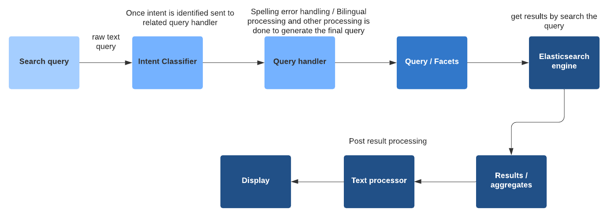

# Sinhala Song Search App 

This repository contain source code for Sinhala song search engine created using Python and Elasticsearch

## Directory Structure

The important files and directories of the repository is shown below

    ├── song-corpus : data scraped from the [website](http://sinhalasongbook.com/)                    
        ├── songs.json : contain the final song set 
        ├── songs_01.json to songs_010.json : original songs scraped form the website
        ├── songs_meta_all.json : contain all meta date related to the songs
        └── song_link.csv : contain links to the songs url
    ├── templates : UI related files  
    ├── app.py : Backend of the web app created using Flask 
    ├── data_upload.py : File to upload data to elasticsearch cluster
    ├── scraper.py :  Source code for the data scraper  
    ├── search.py : Search functions used to classify user search phrases and elasticsearch queries
    ├── queries.txt :  Example queries          


## Starting the web app

### Spinning the elasticsearch cluster

You can install elasticsearch locally or otherwise and spin up the elasticsearch cluster
For more details visit [website](https://www.elastic.co/guide/en/elasticsearch/reference/current/getting-started-install.html)

Once elasticsearch is install, start elasticsearch cluster on port 9200

### Getting started with the web app

```commandline
git clone https://github.com/iTharindu/SinhalaSongSearch.git

cd Sinhala Songs Search

virtualenv -p python3 envname

source env/bin/activate

pip3 install -r requirements.txt

python app.py
```

### To run the web scraper

Follow the above steps but instead of `python app.py` run `scraper.py`

## Data fields 

Each song contain subset of following data fields

1. Title (both in Sinhala and English letters) 
2. Artist - English
3. Artist - Sinhala
4. Composer - English
5. Composer - Sinhala
6. Lyricist - English
7. Lyricist - Sinhala
8. Genre - English
9. Genre - Sinhala
10. Number of views
11. Guitar keys
12. Name of the movie (if the song is based on a movie)
13. Lyrics

## Data Scraping process

The process with scraping data from the site, the HTML/XML parsing library BeautifulSoup was used for scraping the web pages. Then the text extracted was passed through the text processing unit. Both simple techniques like replacing complex methods like regex are used for this process. This text processing unit generates cleaned text data which is then passed to the translator to translate to Sinhala, here both translation and transliteration takes place. Then the translated data is sent for post processing and the final data set with an aggregated dataset containing information about fields is generated


## Search Process

### Indexing and quering

For indexing the data and querying the Elasticsearch is used and I have used the standard indexing methods,mapping and the analyzer provided in the Elasticsearch. When a user enters a query the related intent is identified and the search query is related to the intent is executed. The searching can be done related to any field in the index and predefined size is used which the user can override using his search query. Also filtered queries are provided where users can filter the search result. 

## Advance Features                  
* Text mining and text preprocessing
    * Search queries are processed before intent classification, here spelling errors are corrected and the query is cleaned. Also data extracted is also cleaned and processed before displaying on the web application.
* Intent Classification
    * Once the query is added, intent behind the query is found by intent classification. The intent could be simple text search or a select top type, etc. The intent classifier used word tokenization and text vectorization and cosine distance to classify intentens
* Faceted Search
    * The search engine supported faceted search related to Genre, Artist, Composer and Lyricist. 
* Bilingual support
    * The search engine supports queries in both Sinhala and English. User can type queries like top 10 songs or හොඳම ගීත 10 and expect to yield the same result.
* Synonyms support
    * The search engine also support synonyms and that can be either in Sinhala or in English, user can type best, popular, good instead of top or හොඳ, ජනප්රිය, ප්‍රසිද්ධ instead of හොඳම. 
* Resistant to simple spelling errors
    * Due to the use of vectorization and distance calculation the search engine is resistant to small spelling errors and these are automatically corrected and related search results are generated.





